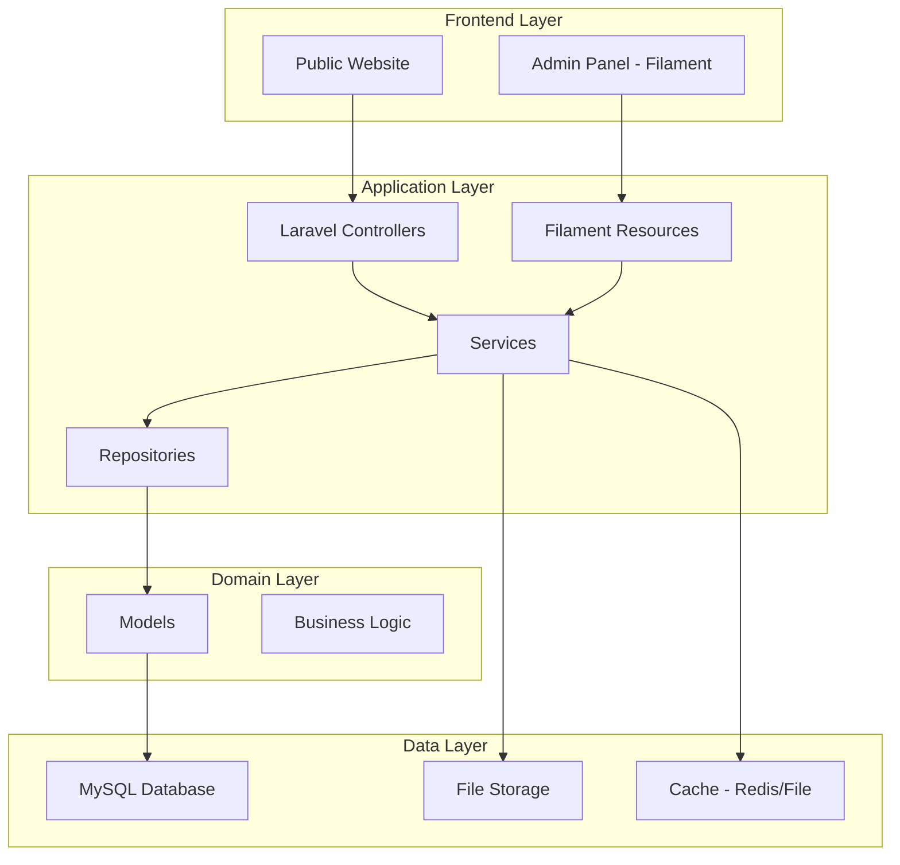
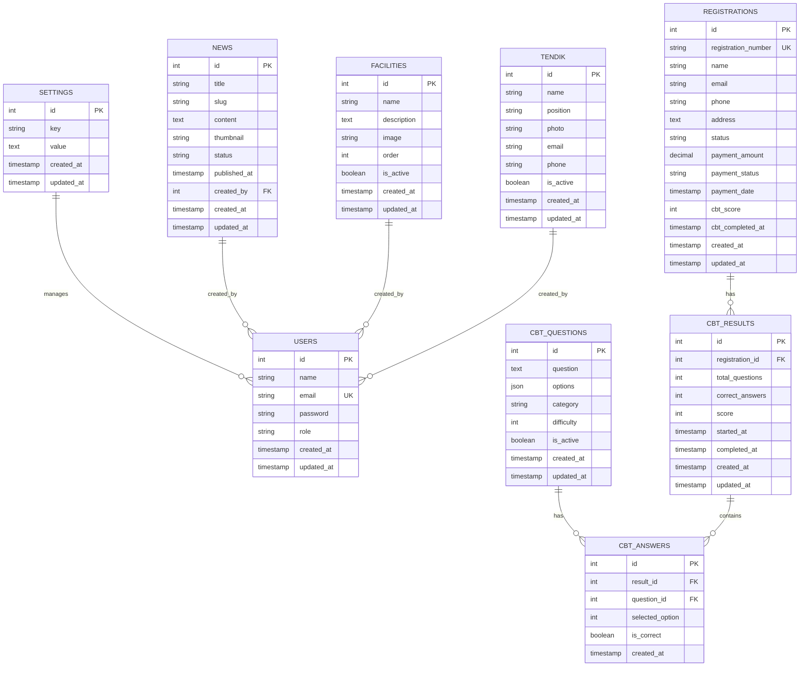

# Design Document: University Website

## Overview

Website kampus STT Pratama Adi adalah aplikasi web full-stack yang dibangun menggunakan Laravel 11 sebagai backend framework dan Filament 3 sebagai admin panel. Website ini menggunakan arsitektur MVC (Model-View-Controller) dengan pendekatan content management system (CMS) yang memungkinkan admin mengelola seluruh konten secara dinamis.

**Technology Stack:**
- **Backend**: Laravel 11 (PHP 8.2+)
- **Admin Panel**: Filament 3
- **Database**: MySQL 8.0+
- **Frontend**: Blade Templates + Tailwind CSS + Alpine.js
- **Asset Management**: Vite
- **Image Processing**: Intervention Image
- **Authentication**: Laravel Breeze/Sanctum

**Key Design Principles:**
1. **Content-First**: Semua konten dapat dikelola melalui admin panel
2. **Performance**: Optimasi query, caching, dan lazy loading
3. **Security**: Input validation, CSRF protection, dan role-based access
4. **Maintainability**: Clean code, separation of concerns, dan dokumentasi
5. **User Experience**: Responsive design, smooth animations, dan intuitive navigation

## Architecture

### System Architecture



### Directory Structure

```
kampus/
├── app/
│   ├── Filament/
│   │   └── Resources/
│   │       ├── NewsResource.php
│   │       ├── FacilityResource.php
│   │       ├── TendikResource.php
│   │       ├── RegistrationResource.php
│   │       ├── CBTQuestionResource.php
│   │       └── SettingResource.php
│   ├── Http/
│   │   ├── Controllers/
│   │   │   ├── HomeController.php
│   │   │   ├── NewsController.php
│   │   │   ├── RegistrationController.php
│   │   │   └── CBTController.php
│   │   └── Requests/
│   │       ├── RegistrationRequest.php
│   │       └── CBTAnswerRequest.php
│   ├── Models/
│   │   ├── News.php
│   │   ├── Facility.php
│   │   ├── Tendik.php
│   │   ├── Registration.php
│   │   ├── CBTQuestion.php
│   │   ├── CBTAnswer.php
│   │   └── Setting.php
│   ├── Services/
│   │   ├── RegistrationService.php
│   │   ├── CBTService.php
│   │   └── ImageService.php
│   └── Repositories/
│       ├── NewsRepository.php
│       └── RegistrationRepository.php
├── database/
│   ├── migrations/
│   └── seeders/
├── resources/
│   ├── views/
│   │   ├── layouts/
│   │   │   └── app.blade.php
│   │   ├── home.blade.php
│   │   ├── news/
│   │   ├── registration/
│   │   └── cbt/
│   └── css/
│       └── app.css
├── public/
│   ├── images/
│   └── uploads/
└── routes/
    ├── web.php
    └── api.php
```

## Components and Interfaces

### 1. Frontend Components

#### HomeController
Mengelola tampilan halaman utama dengan konten dinamis.

```php
class HomeController extends Controller
{
    public function index()
    {
        $settings = Setting::getSettings();
        $latestNews = News::published()->latest()->take(6)->get();
        $facilities = Facility::active()->get();
        $tendik = Tendik::active()->get();
        
        return view('home', compact('settings', 'latestNews', 'facilities', 'tendik'));
    }
}
```

#### NewsController
Mengelola tampilan berita.

```php
class NewsController extends Controller
{
    public function index()
    {
        $news = News::published()->latest()->paginate(12);
        return view('news.index', compact('news'));
    }
    
    public function show(News $news)
    {
        return view('news.show', compact('news'));
    }
}
```

#### RegistrationController
Mengelola proses pendaftaran mahasiswa baru.

```php
class RegistrationController extends Controller
{
    public function __construct(
        private RegistrationService $registrationService
    ) {}
    
    public function create()
    {
        return view('registration.create');
    }
    
    public function store(RegistrationRequest $request)
    {
        $registration = $this->registrationService->register($request->validated());
        
        return redirect()
            ->route('registration.payment', $registration)
            ->with('success', 'Data pendaftaran berhasil disimpan');
    }
    
    public function payment(Registration $registration)
    {
        return view('registration.payment', compact('registration'));
    }
    
    public function complete(Registration $registration)
    {
        $waNumber = Setting::get('wa_admin');
        $message = $this->registrationService->generateWhatsAppMessage($registration);
        
        return view('registration.complete', compact('registration', 'waNumber', 'message'));
    }
}
```

#### CBTController
Mengelola sistem ujian online.

```php
class CBTController extends Controller
{
    public function __construct(
        private CBTService $cbtService
    ) {}
    
    public function login()
    {
        return view('cbt.login');
    }
    
    public function authenticate(Request $request)
    {
        $registration = Registration::where('registration_number', $request->registration_number)
            ->where('status', 'paid')
            ->firstOrFail();
            
        session(['cbt_registration_id' => $registration->id]);
        
        return redirect()->route('cbt.start');
    }
    
    public function start()
    {
        $questions = $this->cbtService->getRandomQuestions(50);
        $duration = 90; // minutes
        
        return view('cbt.exam', compact('questions', 'duration'));
    }
    
    public function submit(CBTAnswerRequest $request)
    {
        $score = $this->cbtService->calculateScore($request->validated());
        
        return view('cbt.result', compact('score'));
    }
}
```

### 2. Admin Panel Components (Filament Resources)

#### NewsResource
Mengelola CRUD berita di admin panel.

```php
class NewsResource extends Resource
{
    protected static ?string $model = News::class;
    protected static ?string $navigationIcon = 'heroicon-o-newspaper';
    protected static ?string $navigationLabel = 'Berita';
    
    public static function form(Form $form): Form
    {
        return $form->schema([
            TextInput::make('title')->required()->maxLength(255),
            FileUpload::make('thumbnail')->image()->required(),
            RichEditor::make('content')->required(),
            Select::make('status')
                ->options([
                    'draft' => 'Draft',
                    'published' => 'Published',
                ])
                ->default('draft'),
            DateTimePicker::make('published_at'),
        ]);
    }
    
    public static function table(Table $table): Table
    {
        return $table
            ->columns([
                ImageColumn::make('thumbnail'),
                TextColumn::make('title')->searchable(),
                BadgeColumn::make('status'),
                TextColumn::make('published_at')->dateTime(),
            ])
            ->filters([
                SelectFilter::make('status'),
            ]);
    }
}
```

#### SettingResource
Mengelola pengaturan website (logo, kontak, dll).

```php
class SettingResource extends Resource
{
    protected static ?string $model = Setting::class;
    protected static ?string $navigationIcon = 'heroicon-o-cog';
    protected static ?string $navigationLabel = 'Pengaturan';
    
    public static function form(Form $form): Form
    {
        return $form->schema([
            Section::make('Identitas Kampus')->schema([
                TextInput::make('university_name')->required(),
                FileUpload::make('logo')->image(),
                Textarea::make('address'),
                TextInput::make('phone'),
                TextInput::make('email')->email(),
            ]),
            
            Section::make('Social Media')->schema([
                TextInput::make('facebook_url')->url(),
                TextInput::make('instagram_url')->url(),
                TextInput::make('youtube_url')->url(),
            ]),
            
            Section::make('WhatsApp Admin')->schema([
                TextInput::make('wa_admin')->required()
                    ->helperText('Format: 628123456789'),
            ]),
        ]);
    }
}
```

#### RegistrationResource
Mengelola data pendaftaran mahasiswa.

```php
class RegistrationResource extends Resource
{
    protected static ?string $model = Registration::class;
    protected static ?string $navigationIcon = 'heroicon-o-user-group';
    protected static ?string $navigationLabel = 'Pendaftaran';
    
    public static function table(Table $table): Table
    {
        return $table
            ->columns([
                TextColumn::make('registration_number')->searchable(),
                TextColumn::make('name')->searchable(),
                TextColumn::make('email'),
                BadgeColumn::make('status')
                    ->colors([
                        'warning' => 'pending',
                        'success' => 'paid',
                        'danger' => 'cancelled',
                    ]),
                TextColumn::make('created_at')->dateTime(),
            ])
            ->filters([
                SelectFilter::make('status'),
            ]);
    }
    
    public static function infolist(Infolist $infolist): Infolist
    {
        return $infolist->schema([
            Section::make('Data Diri')->schema([
                TextEntry::make('name'),
                TextEntry::make('email'),
                TextEntry::make('phone'),
                TextEntry::make('address'),
            ]),
            Section::make('Status')->schema([
                TextEntry::make('registration_number'),
                TextEntry::make('status'),
                TextEntry::make('payment_status'),
            ]),
        ]);
    }
}
```

#### CBTQuestionResource
Mengelola soal ujian CBT.

```php
class CBTQuestionResource extends Resource
{
    protected static ?string $model = CBTQuestion::class;
    protected static ?string $navigationIcon = 'heroicon-o-academic-cap';
    protected static ?string $navigationLabel = 'Soal CBT';
    
    public static function form(Form $form): Form
    {
        return $form->schema([
            Textarea::make('question')->required(),
            Repeater::make('options')->schema([
                TextInput::make('text')->required(),
                Checkbox::make('is_correct'),
            ])->minItems(4)->maxItems(5),
            Select::make('category')
                ->options([
                    'matematika' => 'Matematika',
                    'bahasa_inggris' => 'Bahasa Inggris',
                    'logika' => 'Logika',
                ]),
            Toggle::make('is_active')->default(true),
        ]);
    }
}
```

### 3. Service Layer

#### RegistrationService
Business logic untuk proses pendaftaran.

```php
class RegistrationService
{
    public function register(array $data): Registration
    {
        DB::beginTransaction();
        
        try {
            $registration = Registration::create([
                'registration_number' => $this->generateRegistrationNumber(),
                'name' => $data['name'],
                'email' => $data['email'],
                'phone' => $data['phone'],
                'address' => $data['address'],
                'status' => 'pending',
            ]);
            
            DB::commit();
            return $registration;
            
        } catch (\Exception $e) {
            DB::rollBack();
            throw $e;
        }
    }
    
    private function generateRegistrationNumber(): string
    {
        $year = date('Y');
        $lastNumber = Registration::whereYear('created_at', $year)
            ->max('registration_number');
            
        $sequence = $lastNumber ? intval(substr($lastNumber, -4)) + 1 : 1;
        
        return sprintf('REG%s%04d', $year, $sequence);
    }
    
    public function generateWhatsAppMessage(Registration $registration): string
    {
        return "Halo Admin, saya telah menyelesaikan pendaftaran dengan nomor: {$registration->registration_number}. Nama: {$registration->name}. Mohon konfirmasi pembayaran saya.";
    }
}
```

#### CBTService
Business logic untuk sistem ujian.

```php
class CBTService
{
    public function getRandomQuestions(int $count): Collection
    {
        return CBTQuestion::active()
            ->inRandomOrder()
            ->limit($count)
            ->get();
    }
    
    public function calculateScore(array $answers): int
    {
        $correctCount = 0;
        
        foreach ($answers as $questionId => $answerId) {
            $question = CBTQuestion::find($questionId);
            $correctOption = $question->options->firstWhere('is_correct', true);
            
            if ($correctOption && $correctOption->id == $answerId) {
                $correctCount++;
            }
        }
        
        return ($correctCount / count($answers)) * 100;
    }
    
    public function saveResult(Registration $registration, int $score): void
    {
        $registration->update([
            'cbt_score' => $score,
            'cbt_completed_at' => now(),
        ]);
    }
}
```

#### ImageService
Service untuk optimasi gambar.

```php
class ImageService
{
    public function optimize(UploadedFile $file, string $path, array $sizes = []): string
    {
        $filename = Str::random(40) . '.' . $file->getClientOriginalExtension();
        $image = Image::make($file);
        
        // Compress and resize
        $image->resize(1200, null, function ($constraint) {
            $constraint->aspectRatio();
            $constraint->upsize();
        })->save(storage_path("app/public/{$path}/{$filename}"), 80);
        
        // Generate thumbnails
        foreach ($sizes as $size => $dimensions) {
            $thumb = Image::make($file);
            $thumb->fit($dimensions['width'], $dimensions['height'])
                ->save(storage_path("app/public/{$path}/{$size}_{$filename}"), 80);
        }
        
        return "{$path}/{$filename}";
    }
}
```

## Data Models

### Database Schema



### Model Definitions

#### Setting Model
```php
class Setting extends Model
{
    protected $fillable = ['key', 'value'];
    
    public static function get(string $key, $default = null)
    {
        return Cache::remember("setting.{$key}", 3600, function () use ($key, $default) {
            return self::where('key', $key)->value('value') ?? $default;
        });
    }
    
    public static function set(string $key, $value): void
    {
        self::updateOrCreate(['key' => $key], ['value' => $value]);
        Cache::forget("setting.{$key}");
    }
    
    public static function getSettings(): array
    {
        return Cache::remember('settings.all', 3600, function () {
            return self::pluck('value', 'key')->toArray();
        });
    }
}
```

#### News Model
```php
class News extends Model
{
    protected $fillable = [
        'title', 'slug', 'content', 'thumbnail', 
        'status', 'published_at', 'created_by'
    ];
    
    protected $casts = [
        'published_at' => 'datetime',
    ];
    
    public function scopePublished($query)
    {
        return $query->where('status', 'published')
            ->where('published_at', '<=', now());
    }
    
    public function author()
    {
        return $this->belongsTo(User::class, 'created_by');
    }
    
    protected static function boot()
    {
        parent::boot();
        
        static::creating(function ($news) {
            $news->slug = Str::slug($news->title);
            $news->created_by = auth()->id();
        });
    }
}
```

#### Registration Model
```php
class Registration extends Model
{
    protected $fillable = [
        'registration_number', 'name', 'email', 'phone', 
        'address', 'status', 'payment_amount', 'payment_status',
        'payment_date', 'cbt_score', 'cbt_completed_at'
    ];
    
    protected $casts = [
        'payment_date' => 'datetime',
        'cbt_completed_at' => 'datetime',
        'payment_amount' => 'decimal:2',
    ];
    
    public function cbtResult()
    {
        return $this->hasOne(CBTResult::class);
    }
    
    public function scopePending($query)
    {
        return $query->where('status', 'pending');
    }
    
    public function scopePaid($query)
    {
        return $query->where('payment_status', 'paid');
    }
}
```

#### CBTQuestion Model
```php
class CBTQuestion extends Model
{
    protected $fillable = [
        'question', 'options', 'category', 
        'difficulty', 'is_active'
    ];
    
    protected $casts = [
        'options' => 'array',
        'is_active' => 'boolean',
    ];
    
    public function scopeActive($query)
    {
        return $query->where('is_active', true);
    }
    
    public function getCorrectOptionAttribute()
    {
        return collect($this->options)->firstWhere('is_correct', true);
    }
}
```

## Correctness Properties

A property is a characteristic or behavior that should hold true across all valid executions of a system—essentially, a formal statement about what the system should do. Properties serve as the bridge between human-readable specifications and machine-verifiable correctness guarantees.

### Property Reflection

After analyzing the acceptance criteria, I identified the following testable properties. I then performed a reflection to eliminate redundancy:

**Redundancy Analysis:**
- Properties 3.4 (data persistence) and 3.9 (status persistence) can be combined into a single comprehensive property about data persistence
- Properties 9.1 (storing WA number) and 9.3 (message template) both relate to WhatsApp functionality and can be tested together
- Properties 6.5 (caching) and 1.6 (content updates) both relate to data retrieval and can be combined

**Final Property Set:**
After reflection, I have 15 unique properties that provide comprehensive validation coverage without redundancy.

### Core Properties

#### Property 1: Data Persistence Round Trip
*For any* valid registration data, after saving to the database, retrieving the registration should return equivalent data with all fields preserved including status.

**Validates: Requirements 3.4, 3.9**

**Testing Strategy:** Generate random registration data, save to database, retrieve by ID, and verify all fields match.

---

#### Property 2: Registration Number Uniqueness
*For any* set of registrations created in the system, all registration numbers must be unique across all records.

**Validates: Requirements 3.5**

**Testing Strategy:** Create multiple registrations and verify that no two registration numbers are identical.

---

#### Property 3: Input Validation Rejection
*For any* invalid registration data (missing required fields, invalid email format, invalid phone format), the validation should reject the input and return appropriate error messages.

**Validates: Requirements 3.3**

**Testing Strategy:** Generate various invalid inputs and verify that validation fails with appropriate error messages.

---

#### Property 4: CBT Authentication
*For any* registration number, if the registration exists and payment status is 'paid', then CBT authentication should succeed; otherwise it should fail.

**Validates: Requirements 4.2**

**Testing Strategy:** Generate registrations with various statuses and verify authentication behavior.

---

#### Property 5: CBT Question Randomization
*For any* two requests for CBT questions, the order of questions should be different (with high probability for large question pools).

**Validates: Requirements 4.3**

**Testing Strategy:** Request questions multiple times and verify that the order varies.

---

#### Property 6: CBT Answer Persistence
*For any* CBT answer submitted, retrieving the answer from the database should return the same question ID, selected option, and timestamp.

**Validates: Requirements 4.4**

**Testing Strategy:** Submit random answers and verify they can be retrieved correctly.

---

#### Property 7: CBT Score Calculation
*For any* set of CBT answers, the calculated score should equal (correct_answers / total_questions) × 100, and should be between 0 and 100.

**Validates: Requirements 4.7**

**Testing Strategy:** Generate various answer combinations with known correct answers and verify score calculation.

---

#### Property 8: Admin Authentication Required
*For any* request to admin panel routes without valid authentication, the system should redirect to login page or return 401/403 status.

**Validates: Requirements 5.2**

**Testing Strategy:** Attempt to access admin routes without authentication and verify rejection.

---

#### Property 9: Query Optimization with Eager Loading
*For any* page that displays related data (e.g., news with author), the number of database queries should not exceed N+1 where N is the number of main records.

**Validates: Requirements 6.4**

**Testing Strategy:** Monitor query count when loading pages with relationships and verify eager loading is used.

---

#### Property 10: Content Caching and Updates
*For any* cached content, after updating the content in the database, the next retrieval should return the updated content (cache should be invalidated).

**Validates: Requirements 1.6, 6.5**

**Testing Strategy:** Cache content, update it, retrieve again, and verify the updated version is returned.

---

#### Property 11: Image Optimization
*For any* uploaded image, the saved image should have dimensions not exceeding the maximum configured size and file size should be reduced compared to the original.

**Validates: Requirements 6.6, 8.6**

**Testing Strategy:** Upload various images and verify dimensions and file sizes are optimized.

---

#### Property 12: Password Encryption
*For any* user password, the stored password in the database should not match the plaintext password and should be a valid bcrypt hash.

**Validates: Requirements 7.2**

**Testing Strategy:** Create users with various passwords and verify stored passwords are hashed.

---

#### Property 13: Role-Based Access Control
*For any* user without admin role, attempts to access admin panel resources should be denied with appropriate error response.

**Validates: Requirements 7.6**

**Testing Strategy:** Create users with different roles and verify access control.

---

#### Property 14: Draft Content Exclusion
*For any* content with status 'draft' or published_at date in the future, the content should not appear in public frontend queries.

**Validates: Requirements 8.4, 8.5**

**Testing Strategy:** Create content with various statuses and published dates, query public endpoints, and verify only published content appears.

---

#### Property 15: WhatsApp Message Generation
*For any* registration, the generated WhatsApp message should contain the registration number, name, and be properly URL-encoded for WhatsApp API.

**Validates: Requirements 9.1, 9.3**

**Testing Strategy:** Generate registrations and verify WhatsApp messages contain required information and are properly formatted.

---

## Error Handling

### Validation Errors

**Registration Form:**
- Required field validation with clear error messages
- Email format validation
- Phone number format validation (Indonesian format)
- Minimum/maximum length validation

**CBT System:**
- Invalid registration number error
- Unpaid registration error
- Session timeout handling
- Invalid answer format error

**Admin Panel:**
- Filament handles validation automatically
- Custom validation rules for specific fields
- File upload validation (size, type, dimensions)

### Database Errors

**Connection Errors:**
- Retry logic for transient failures
- Graceful degradation with error messages
- Logging for debugging

**Transaction Errors:**
- Automatic rollback on failure
- Clear error messages to users
- Detailed logging for administrators

### File Upload Errors

**Image Upload:**
- File size limit validation (max 5MB)
- File type validation (jpg, png, gif)
- Dimension validation for specific use cases
- Storage space error handling

**Error Messages:**
- User-friendly messages in Indonesian
- Technical details logged for administrators
- Suggestions for resolution when possible

### Security Errors

**Authentication Failures:**
- Rate limiting for login attempts
- Clear error messages without revealing user existence
- Account lockout after multiple failures

**Authorization Failures:**
- 403 Forbidden for insufficient permissions
- Redirect to appropriate page
- Logging of unauthorized access attempts

**CSRF Token Errors:**
- Automatic token refresh
- Clear error message to retry
- Session validation

## Testing Strategy

### Unit Testing

**Models:**
- Test model relationships
- Test scopes and query builders
- Test accessors and mutators
- Test model events (creating, updating, etc.)

**Services:**
- Test business logic in isolation
- Test with mock dependencies
- Test error handling
- Test edge cases

**Controllers:**
- Test request handling
- Test response format
- Test validation
- Test authorization

**Example Unit Tests:**
```php
// Test registration number generation
public function test_registration_number_is_unique()
{
    $registration1 = Registration::factory()->create();
    $registration2 = Registration::factory()->create();
    
    $this->assertNotEquals(
        $registration1->registration_number,
        $registration2->registration_number
    );
}

// Test news published scope
public function test_published_scope_only_returns_published_news()
{
    News::factory()->create(['status' => 'draft']);
    News::factory()->create(['status' => 'published', 'published_at' => now()]);
    
    $publishedNews = News::published()->get();
    
    $this->assertCount(1, $publishedNews);
    $this->assertEquals('published', $publishedNews->first()->status);
}
```

### Property-Based Testing

**Testing Framework:** We will use **Pest PHP** with **Pest Property Testing Plugin** for property-based testing.

**Configuration:**
- Minimum 100 iterations per property test
- Each test tagged with feature name and property number
- Tests organized by domain (Registration, CBT, Content, etc.)

**Property Test Examples:**

```php
use function Pest\Property\forAll;

// Property 1: Data Persistence Round Trip
test('registration data persists correctly', function () {
    forAll(
        registrationData()
    )->then(function ($data) {
        $registration = Registration::create($data);
        $retrieved = Registration::find($registration->id);
        
        expect($retrieved->name)->toBe($data['name'])
            ->and($retrieved->email)->toBe($data['email'])
            ->and($retrieved->phone)->toBe($data['phone'])
            ->and($retrieved->status)->toBe('pending');
    });
})->tag('Feature: university-website', 'Property 1: Data Persistence Round Trip');

// Property 2: Registration Number Uniqueness
test('registration numbers are always unique', function () {
    forAll(
        registrationData(),
        registrationData()
    )->then(function ($data1, $data2) {
        $reg1 = Registration::create($data1);
        $reg2 = Registration::create($data2);
        
        expect($reg1->registration_number)
            ->not->toBe($reg2->registration_number);
    });
})->tag('Feature: university-website', 'Property 2: Registration Number Uniqueness');

// Property 7: CBT Score Calculation
test('CBT score is calculated correctly', function () {
    forAll(
        cbtAnswers()
    )->then(function ($answers) {
        $service = new CBTService();
        $score = $service->calculateScore($answers);
        
        expect($score)->toBeGreaterThanOrEqual(0)
            ->and($score)->toBeLessThanOrEqual(100);
            
        // Verify calculation formula
        $correctCount = collect($answers)->filter(fn($a) => $a['is_correct'])->count();
        $expectedScore = ($correctCount / count($answers)) * 100;
        
        expect($score)->toBe($expectedScore);
    });
})->tag('Feature: university-website', 'Property 7: CBT Score Calculation');
```

**Custom Generators:**

```php
// Generator for registration data
function registrationData(): Generator
{
    return forAll(
        Str::random(10), // name
        Str::random(5) . '@example.com', // email
        '08' . rand(1000000000, 9999999999), // phone
        Str::random(50) // address
    )->map(fn($name, $email, $phone, $address) => [
        'name' => $name,
        'email' => $email,
        'phone' => $phone,
        'address' => $address,
    ]);
}

// Generator for CBT answers
function cbtAnswers(): Generator
{
    return forAll(
        integers()->between(10, 50) // number of questions
    )->map(function ($count) {
        $questions = CBTQuestion::factory()->count($count)->create();
        
        return $questions->map(function ($question) {
            $selectedOption = rand(0, count($question->options) - 1);
            $isCorrect = $question->options[$selectedOption]['is_correct'] ?? false;
            
            return [
                'question_id' => $question->id,
                'selected_option' => $selectedOption,
                'is_correct' => $isCorrect,
            ];
        })->toArray();
    });
}
```

### Integration Testing

**Full Flow Tests:**
- Test complete registration flow (form → validation → save → payment → WhatsApp)
- Test complete CBT flow (login → questions → answers → score)
- Test admin content management flow (create → edit → publish)

**Database Integration:**
- Test with actual MySQL database (not SQLite)
- Test migrations and seeders
- Test database transactions

**File System Integration:**
- Test image upload and optimization
- Test file storage and retrieval
- Test file deletion

### Browser Testing (Optional)

**Laravel Dusk:**
- Test critical user flows in real browser
- Test responsive design
- Test JavaScript interactions
- Test form submissions

### Performance Testing

**Load Testing:**
- Test with multiple concurrent users
- Test database query performance
- Test caching effectiveness
- Test image optimization performance

**Benchmarking:**
- Measure page load times
- Measure API response times
- Measure database query times
- Set performance budgets

### Security Testing

**Automated Security Scans:**
- SQL injection testing
- XSS vulnerability testing
- CSRF protection testing
- Authentication bypass testing

**Manual Security Review:**
- Code review for security issues
- Dependency vulnerability scanning
- Configuration review
- Access control testing

### Testing Best Practices

1. **Test Isolation:** Each test should be independent and not rely on other tests
2. **Database Transactions:** Use database transactions to rollback changes after each test
3. **Factory Usage:** Use factories to generate test data consistently
4. **Meaningful Assertions:** Use descriptive assertion messages
5. **Test Coverage:** Aim for 80%+ code coverage for critical paths
6. **Continuous Integration:** Run tests automatically on every commit
7. **Test Documentation:** Document complex test scenarios and edge cases

